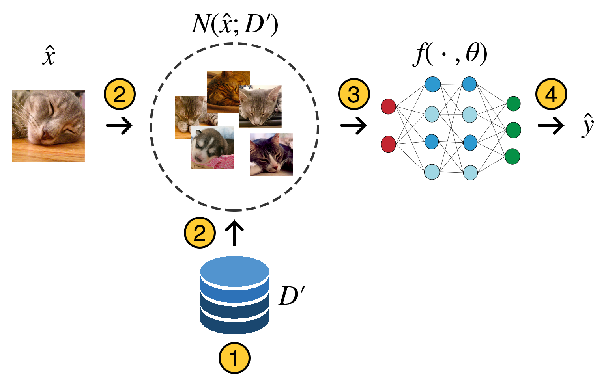

# Runtime-Masking-and-Cleansing (RMC)
This is the repo for [Adversarial Robustness via Runtime Masking and Cleansing](http://proceedings.mlr.press/v119/wu20f/wu20f.pdf), Yi-Hsuan Wu, Chia-Hung Yuan, and Shan-Hung Wu, In Proceedings of ICML 2020. Our code is implemented in TensorFlow 2.0 using all the best practices.

We devise a new defense method, called runtime masking and cleansing (RMC), to improve adversarial robustness. RMC adapts the network at runtime before making a prediction to dynamically mask network gradients and cleanse the model of the non-robust features inevitably learned during the training process due to the size limit of the training set.

The following figure illustrates the defense mechanism in RMC:

<p align="center">
	
</p>

1. Augment dataset with adversarial examples
2. Find K-nearest neighbors (KNN) of test data from the augmented dataset
3. Adapt the network with KNN
4. Make predictions

For more details, please refer to our [main paper](https://proceedings.icml.cc/static/paper_files/icml/2020/377-Paper.pdf), [supplementary materials](http://proceedings.mlr.press/v119/wu20f/wu20f.pdf), [video](https://icml.cc/virtual/2020/poster/5817), or [slide](http://www.cs.nthu.edu.tw/~shwu/pubs/shwu-icml-20-slides.pdf).

## Installation
Clone and install requirements.
```bash
git clone https://github.com/nthu-datalab/Runtime-Masking-and-Cleansing.git
cd Runtime-Masking-and-Cleansing
pip install -r requirements.txt
```

## Usage
RMC works well with any existing model architecture. The following command evaluate pretrained ResNet-152v2 downloaded from [TensorFlow website](https://www.tensorflow.org/api_docs/python/tf/keras/applications/ResNet152) on ImageNet:
```bash
python evaluate.py
```

It is worth noticing that before running ```evaluate.py```, we have to create the augmented dataset, adversarial examples for evaluation, and extract features (hidden representations) from those data. All corresponding codes can be found in ```/prepare``` folder. For example, the following command creates the perturbed training dataset with PGD (Projected Gradient Descent) attack.
```bash
cd prepare
python augment_dataset.py
```

To visualize the test data and its corresponding nearest neighbors, please refer to ```visualize.ipynb```.

### Directories
Before running any code, please set directories first.
- ```BASE_DIR```: Path to "Runtime-Masking-and-Cleansing" folder.
- ```TRAIN_DATA_DIR```: Path to training dataset.
- ```TRAIN_LABEL_DIR```: Path to labels of training dataset.
- ```AUG_DATA_DIR```: Path to augmented dataset.
- ```AUG_FEATURES```: Path to features of augmented dataset. 
- ```EVAL_DATA_DIR```: Path to evaluation dataset.
- ```EVAL_LABEL_DIR```: Path to label of evaluation dataset.
- ```EVAL_FEATURES```: Path to features of evaluation dataset.
- ```ATTACK_DATA_DIR```: Path to perturbed evaluation dataset.
- ```ATTACK_LABEL_DIR```: Path to the target label of perturbed evaluation data. Only use when evaluating targeted attack.
- ```ATTACK_FEATURES```: Path to features of perturbed evaluation dataset.

### Hyperparameters
Evaluate with different configurations:
```python
K = 2048
EPOCHS = 100
EARLY_STOP = 5
LEARNING_RATE = 1e-5
BUFFER_SIZE = 10000
IMG_SIZE = 224
RESIZE_SIZE = 256
BATCH_SIZE = 64
IMG_SHAPE = (IMG_SIZE, IMG_SIZE, 3)
EPSILON = 16/255
EPS_ITERS = 1/255
NB_ITERS = 100
```
- ```K```: Hyperparameter in k-NN.
- ```EARLY_STOP```: Early stop criteria.
- ```EPSILON```: Allowable perturbation when computing adversarial examples.
- ```EPS_ITERS```: Step size used in PGD attack.
- ```NB_ITERS```: Number of iterations used in PGD attack.

## Dataset
We use MNIST, CIFAR-10, and [ImageNet](http://www.image-net.org/) dataset in our paper. First two can be downloaded through TensorFlow API.

## Results
<table>
<thead>
<tr>
<th align="left" rowspan=2>Model</th>
<th align="center">Clean Accuracy (%)</th>
<th align="center" colspan=3>Error Rate / Attack Success Rate (%)</th>
</tr>
<tr>
<th align="center">Clean Images</th>
<th align="center">10-step PGD(8/255)</th>
<th align="center">10-step PGD(16/255)</th>
<th align="center">100-step PGD(16/255)</th>
</tr>
</thead>

<tbody>
<tr>
<td align="left">None</td>
<td align="center">72.9</td>
<td align="center">8.5 / 54.69</td>
<td align="center">5.2 / 61.7</td>
<td align="center">0.6 / 98.1</td>
</tr>

<tr>
<td align="left"><a href="https://github.com/facebookresearch/ImageNet-Adversarial-Training/blob/master/INSTRUCTIONS.md" target="_blank">Adv. Trained</a></td>
<td align="center">62.3</td>
<td align="center">N/A</td>
<td align="center">52.5 / 5.5</td>
<td align="center">41.7 / 31.0</td>
</tr>

<tr>
<td align="left"><a href="https://github.com/facebookresearch/ImageNet-Adversarial-Training/blob/master/INSTRUCTIONS.md" target="_blank">Denoising Block</a></td>
<td align="center">65.3</td>
<td align="center">N/A</td>
<td align="center">55.7 / 4.9</td>
<td align="center">45.5 / 26.6</td>
</tr>

<tr>
<td align="left">DeepNN</td>
<td align="center">26.6</td>
<td align="center">12.9 / <b>0.16</b></td>
<td align="center">8.7 / 1.2</td>
<td align="center">7.8 / 1.2</td>
</tr>

<tr>
<td align="left">WebNN</td>
<td align="center">27.8</td>
<td align="center">18.8 / 0.54</td>
<td align="center">15.2 / <b>0.3</b></td>
<td align="center">13.9 / <b>0.3</b></td>
</tr>

<tr>
<td align="left">RMC</td>
<td align="center"><b>73.6</b></td>
<td align="center"><b>62.4</b> / 0.28</td>
<td align="center"><b>55.9</b> / 1.6</td>
<td align="center"><b>55.6</b> / 1.3</td>
</tr>
</tbody>
</table>

## Citation
If you find this code is helpful for your research, please cite our [ICML 2020 paper](http://proceedings.mlr.press/v119/wu20f/wu20f.pdf):
```
@inproceedings{wu2020adversarial,
	title={Adversarial Robustness via Runtime Masking and Cleansing},
	author={Wu, Yi-Hsuan and Yuan, Chia-Hung and Wu, Shan-Hung},
	booktitle={International Conference on Machine Learning},
	pages={10399--10409},
	year={2020},
	organization={PMLR}
}
```